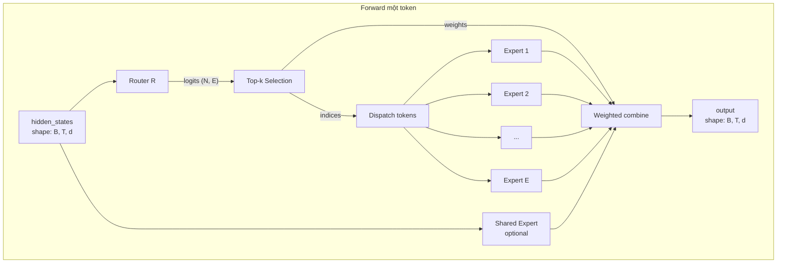
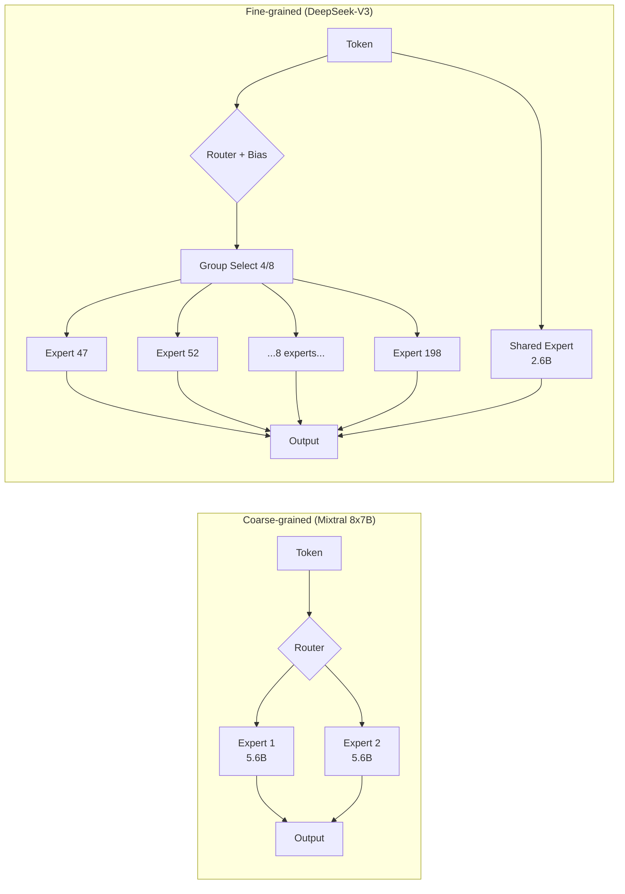

# Phần 6: Mathematical Modeling và Visualization

Phần này là **mathematical foundation** của toàn series. Năm phần trước nói về "cái gì" và "làm thế nào". Phần này nói về "vì sao đúng" qua công thức, derivation, sơ đồ.

Khán giả: bạn đã đọc Phần 1-5 và muốn hiểu sâu hơn ở mức research / theory. Hoặc bạn là người thiên về math và muốn frame mọi thứ trong ký hiệu chính xác.

## Mục tiêu Phần 6

Sau Phần 6, bạn:

1. Formalize được forward pass MoE bằng notation toán học.
2. Derive được auxiliary loss từ first principle (Cauchy-Schwarz).
3. Tính được FLOPs và memory chính xác cho mỗi model.
4. Phân tích communication bandwidth của EP.
5. Có bộ sơ đồ Mermaid + ASCII chart làm tài liệu thuyết trình.

## Cấu trúc Phần 6

- Chương 2: **Router mathematics**. Gate logits, softmax/sigmoid, top-k operator, jitter as multiplicative noise.
- Chương 3: **Load balancing derivations**. Aux loss từ first principle, z-loss, bias adjustment as control.
- Chương 4: **Scaling laws, FLOPs, memory**. Active vs total breakdown, compute equations, memory profile.
- Chương 5: **Communication bandwidth**. EP all-to-all analysis, NVLink vs InfiniBand.
- Chương 6: **Visualizations collected**. Tất cả diagram Mermaid trong một chỗ, sẵn sàng để slide.

## Quy ước ký hiệu

Toàn Phần 6 dùng notation thống nhất:

| Ký hiệu | Ý nghĩa | Ví dụ value (DeepSeek-V3) |
|---|---|---|
| $B$ | batch size | 8 |
| $T$ | sequence length | 4096 |
| $N = B \cdot T$ | total tokens trong batch | 32768 |
| $d$ | hidden dimension | 7168 |
| $d_\text{ff}$ | expert FFN intermediate dim | 2048 |
| $L$ | số decoder layer | 61 |
| $L_\text{moe}$ | số layer có MoE | 58 |
| $E$ | num_experts (routed) | 256 |
| $E_s$ | num_shared_experts | 1 |
| $k$ | top-k | 8 |
| $G$ | n_group | 8 |
| $k_G$ | topk_group | 4 |
| $h$ | num_attention_heads | 128 |
| $h_\text{kv}$ | num_kv_heads | 128 (MLA) |
| $d_\text{head}$ | head_dim | 128 |
| $V$ | vocab_size | 129280 |
| $P_\text{active}$ | active parameters | 37B |
| $P_\text{total}$ | total parameters | 671B |
| $b$ | dtype bytes per element | 2 (bf16) |

## Một số phương trình "must-know"

Trước khi đi sâu, đây là các phương trình bạn sẽ thấy nhiều lần.

### Sparsity ratio

$$
\text{sparsity} = 1 - \frac{P_\text{active}}{P_\text{total}}
$$

DeepSeek-V3: $1 - 37/671 = 94.5\%$ sparsity.

### Active expert parameters

$$
P_\text{expert,active} = k \cdot P_\text{expert,single} + E_s \cdot P_\text{shared,single}
$$

DeepSeek-V3: $8 \cdot 2.6\text{B} + 1 \cdot 2.6\text{B} = 23.4\text{B}$ active expert.

### Per-forward FLOPs (decode)

$$
\text{FLOPs}_\text{decode} \approx 2 N \cdot P_\text{active}
$$

(Factor 2 vì matmul: mỗi param dùng 1 multiply + 1 add.)

### KV cache size

$$
M_\text{cache} = 2 \cdot L \cdot B \cdot T \cdot h_\text{kv} \cdot d_\text{head} \cdot b
$$

DeepSeek-V3 MLA: thay $h_\text{kv} \cdot d_\text{head}$ bằng $d_\text{kv,lora} = 512$.

## Sơ đồ tổng thể

## Sơ đồ scale comparison

## Bố cục phần

Phần 6 không yêu cầu đọc tuần tự. Chương 2 (router math) và Chương 3 (load balancing) là core. Chương 4 (scaling) practical. Chương 5 (communication) cho distributed engineer. Chương 6 visualizations là reference / cheat sheet hình ảnh.

Recommend đọc theo thứ tự nếu lần đầu. Nếu chỉ cần slide deck: nhảy thẳng Chương 6.

Chương sau ta đi sâu router mathematics.
