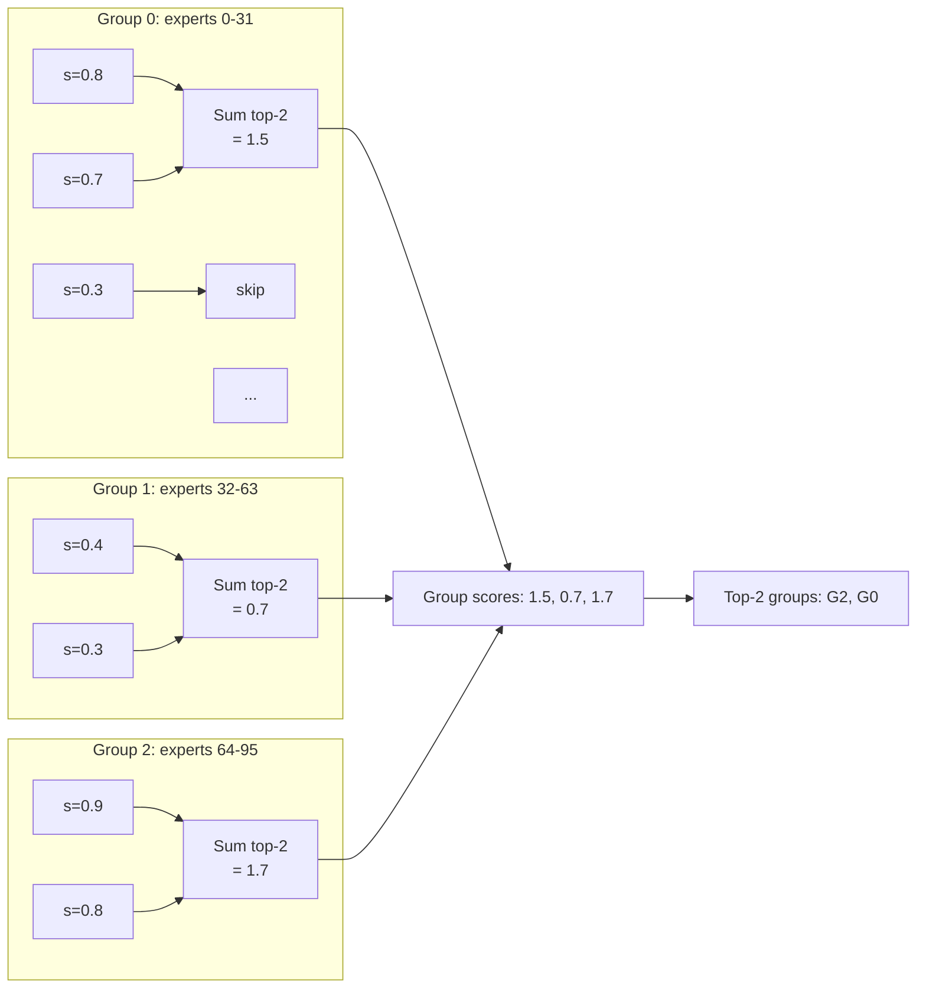

# Router mathematics

Router là một classifier: nhận hidden state, xuất expert assignment. Chương này formalize toàn bộ chuỗi thao tác trong router bằng notation chính xác. Tất cả lý thuyết Phần 1 Chương 2-3 được derive lại ở đây.

## Setup: notation

Cho:

- Token hidden vector $\mathbf{x} \in \mathbb{R}^d$, với $d$ = hidden dim.
- Số expert: $E$.
- Top-k: $k \le E$.
- Router weight: $\mathbf{W}_R \in \mathbb{R}^{E \times d}$.
- (Optional) router bias: $\mathbf{b}_R \in \mathbb{R}^E$.

Forward một token qua router:

$$
\mathbf{z} = \mathbf{W}_R \mathbf{x} + \mathbf{b}_R \in \mathbb{R}^E
$$

$\mathbf{z}$ là **gate logits** (raw scores).

## Softmax normalization

Với softmax routing (Mixtral, Switch):

$$
\mathbf{p} = \text{softmax}(\mathbf{z}), \quad p_i = \frac{\exp(z_i)}{\sum_{j=1}^{E} \exp(z_j)}
$$

Properties:

1. $p_i \ge 0$ với mọi $i$.
2. $\sum_{i=1}^{E} p_i = 1$.
3. Monotonic with $z_i$: $z_i > z_j \Rightarrow p_i > p_j$.
4. Translation invariant: $\text{softmax}(\mathbf{z}) = \text{softmax}(\mathbf{z} + c \mathbf{1})$ với mọi $c$.

## Sigmoid normalization (DeepSeek-V3)

$$
s_i = \sigma(z_i) = \frac{1}{1 + \exp(-z_i)}
$$

Properties:

1. $s_i \in (0, 1)$ với mọi $i$.
2. Mỗi $s_i$ **độc lập**, không có constraint sum.
3. $s_i = 0.5 \Leftrightarrow z_i = 0$.

Khác softmax: không cạnh tranh zero-sum. Multi-hot OK.

## So sánh distribution

```mermaid
graph LR
    subgraph Softmax["Softmax (sum = 1)"]
        SX[z=[3, 1, -1, 0, 2]] --> SY[p=[0.51, 0.07, 0.01, 0.03, 0.38]]
    end

    subgraph Sigmoid["Sigmoid (independent)"]
        GX[z=[3, 1, -1, 0, 2]] --> GY[s=[0.95, 0.73, 0.27, 0.50, 0.88]]
    end
```

Sigmoid output magnitude tổng quát cao hơn (multiple hot). Đó là lý do DeepSeek-V3 cần `routed_scaling_factor = 2.5` để output có magnitude tương đương softmax.

## Top-k operator

Definition: cho vector $\mathbf{u} \in \mathbb{R}^E$, top-k chọn $k$ indices có giá trị cao nhất:

$$
\mathcal{T}_k(\mathbf{u}) = \{i_1, i_2, \ldots, i_k\} \text{ sao cho } u_{i_1} \ge u_{i_2} \ge \cdots \ge u_{i_k} \ge u_j, \forall j \notin \mathcal{T}_k
$$

Output là tập index, không ordered (trừ khi sorted).

Implementation trong PyTorch:

```python
values, indices = torch.topk(u, k, dim=-1)  # (k,), (k,)
```

## Top-k với softmax: Mixtral

```
1. z = W_R @ x                       # (E,)
2. p = softmax(z)                    # (E,) sum=1
3. indices = topk(p, k).indices      # (k,) expert ids
4. weights_raw = p[indices]          # (k,) the top-k prob
5. weights = weights_raw / sum(weights_raw)   # (k,) renorm, sum=1
```

Mathematical step 5 (renormalize):

$$
w_i = \frac{p_{i_t}}{\sum_{j=1}^{k} p_{i_j}} \quad \text{với } i_t \in \mathcal{T}_k(\mathbf{p})
$$

Sau renorm: $\sum_{t=1}^{k} w_t = 1$.

## Top-k với sigmoid + bias: DeepSeek-V3

```
1. z = W_R @ x                          # (E,)
2. s = sigmoid(z)                       # (E,) each in [0,1]
3. s_choice = s + b                     # (E,) for selection
4. group_scores = score_groups(s_choice) # (G,) sum top-2 per group
5. selected_groups = topk(group_scores, k_G)  # (k_G,)
6. s_masked = s_choice * group_mask     # (E,) outside masked to -inf
7. indices = topk(s_masked, k).indices  # (k,)
8. weights_raw = s[indices]             # (k,) use s without bias
9. weights = weights_raw / sum(weights_raw)
10. weights *= routed_scaling_factor    # 2.5x
```

**Key**: step 3 uses `s_choice = s + b` (with bias) for choice; step 8 uses `s` (no bias) for output combine. Bias không méo combination.

## Group score formula

Cho expert chia thành $G$ group, mỗi group có $E/G$ expert. Score group $g$:

$$
\text{group\_score}_g = \sum_{i \in \text{top-2 of group } g} s_{\text{choice}, i}
$$

Tổng top-2 trong group là một heuristic của "group strength".



## Jitter noise modeling

Jitter: thêm multiplicative noise vào hidden_states trước router:

$$
\mathbf{x}_\text{jittered} = \mathbf{x} \odot \boldsymbol{\eta}, \quad \boldsymbol{\eta} \sim \mathcal{U}(1 - \epsilon, 1 + \epsilon)^d
$$

trong đó $\mathcal{U}$ là uniform distribution.

Effect on router output:

$$
\mathbf{z}_\text{jittered} = \mathbf{W}_R (\mathbf{x} \odot \boldsymbol{\eta})
$$

Per dimension:

$$
z_{\text{jittered}, i} = \sum_{j=1}^{d} W_{R,ij} x_j \eta_j
$$

Vì $\mathbb{E}[\eta_j] = 1$, expected value: $\mathbb{E}[z_{\text{jittered}, i}] = z_i$.

Variance:

$$
\text{Var}[z_{\text{jittered}, i}] = \sum_j W_{R,ij}^2 x_j^2 \cdot \text{Var}[\eta_j] = \frac{\epsilon^2}{3} \sum_j W_{R,ij}^2 x_j^2
$$

(Vì uniform $\mathcal{U}(a, b)$ có variance $\frac{(b-a)^2}{12}$, tức $\frac{(2\epsilon)^2}{12} = \frac{\epsilon^2}{3}$.)

Với $\epsilon = 0.01$ (Switch): noise nhỏ, tạo perturbation cho exploration mà không phá routing.

## Argmax vs argmax-with-temperature

Cho $\tau > 0$:

$$
\text{softmax}_\tau(z)_i = \frac{\exp(z_i / \tau)}{\sum_j \exp(z_j / \tau)}
$$

- $\tau \to 0$: distribution sharp → tương đương argmax (one-hot).
- $\tau = 1$: standard softmax.
- $\tau \to \infty$: uniform.

Router trong MoE không dùng temperature explicit (default $\tau = 1$). Nhưng:

$$
\text{softmax}(c \mathbf{z}) = \text{softmax}_{1/c}(\mathbf{z})
$$

Nếu router logit magnitude tăng (do gradient pump aux loss), effective temperature giảm → sharp distribution → expert collapse.

Đây là motivation của **z-loss** (Phần 1 Chương 4, math derivation ở Chương 3 Phần 6).

## Top-k qua softmax: probability of selection

Cho expert $i$ với prob $p_i$, xác suất expert được chọn vào top-k (giả định k=1 cho đơn giản):

$$
\Pr[i \in \mathcal{T}_1(\mathbf{p})] = \Pr[p_i = \max_j p_j]
$$

Khi router đã train tốt và phân bố không trivial, top-k expert được chọn deterministic. Trước train (uniform p), mỗi expert có xác suất $1/E$.

Cho k=2:

$$
\Pr[i \in \mathcal{T}_2(\mathbf{p})] = \Pr[p_i \ge p_{(2)}]
$$

trong đó $p_{(2)}$ là 2nd largest.

Với router uniform init: $\Pr = k/E$. Mixtral $2/8 = 25\%$. DeepSeek-V3 $8/256 \approx 3.1\%$.

## Routing entropy

Entropy đo mức độ "không chắc chắn" của router:

$$
H(\mathbf{p}) = -\sum_{i=1}^{E} p_i \log p_i
$$

- $H = 0$: distribution one-hot (router rất tự tin một expert).
- $H = \log E$: uniform (router phân vân đều).

Mixtral $\log 8 = 3$ nats max. DeepSeek-V3 $\log 256 \approx 5.55$ nats max.

Training pre-routing đạt cao entropy. Sau training, một số token có entropy thấp (chuyên hoá), một số cao (uncertain).

Monitor average entropy giúp detect router collapse: nếu $H$ giảm xuống $0$ → expert collapse.

## ASCII chart: routing distribution over training

```
Entropy of routing distribution over training (Mixtral hypothetical):

H(p) (nats)
  3.0 |******                                     <- Init (uniform)
  2.5 |    ********
  2.0 |            ************
  1.5 |                        ***************
  1.0 |                                       *****  <- After 50k steps
  0.5 |                                            ****  <- After 200k steps
  0.0 |________________________________________________
       0    20k   50k   100k  200k    Training step
```

Healthy training: entropy giảm dần, dừng ở mức ~1.0-1.5 (chuyên hoá nhưng không collapse).

Unhealthy: entropy → 0 sớm. Aux loss coef quá nhỏ.

## Pitfall mathematical

**1. Softmax với router logits có exponent overflow**: nếu $z_i$ lớn (e.g., 100), $\exp(z_i)$ overflow bf16. Subtract max: $\text{softmax}(z) = \text{softmax}(z - \max(z))$. PyTorch handle, nhưng manual implementation phải nhớ.

**2. Top-k với ties**: nếu $p_i = p_j$ cho 2 expert ở boundary top-k, PyTorch chọn deterministic theo index. Pretrain reproducibility cần này.

**3. Renormalize với zero**: nếu $\sum_t p_{i_t} = 0$ (corner case), division by zero. Add epsilon: $w_t = p_{i_t} / (\sum + 10^{-20})$.

**4. Sigmoid + topk monotonic**: vì $\sigma$ monotonic in $z$, $\text{topk}(\sigma(z)) = \text{topk}(z)$. Có thể skip sigmoid cho topk indices, chỉ apply cho weights. Một số implementation tối ưu này.

**5. Jitter ở inference**: phải tắt. `if self.training` check.

Chương sau ta đi load balancing derivations.
