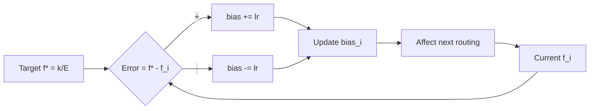

# Load balancing derivations

Chương này derive aux loss từ first principle (Cauchy-Schwarz inequality), phân tích gradient, mô hình hoá bias adjustment as control system. Math heavy. Audience: research-oriented.

## Setup

Notation Phần 1 Chương 4:

- $N$ tokens, $E$ experts, $k$ top-k.
- $p_{t,i} \in [0, 1]$: routing prob của expert $i$ cho token $t$.
- $\mathcal{T}_k(\mathbf{p}_t)$: top-k indices của token $t$.
- $\mathbb{1}[i \in \mathcal{T}_k(t)]$: indicator function.

Hai quantity quan trọng:

**Fraction of tokens routed to expert $i$**:

$$
f_i = \frac{1}{N} \sum_{t=1}^{N} \mathbb{1}[i \in \mathcal{T}_k(\mathbf{p}_t)]
$$

**Average routing probability for expert $i$**:

$$
P_i = \frac{1}{N} \sum_{t=1}^{N} p_{t,i}
$$

Properties:

1. $\sum_{i=1}^{E} f_i = k$ (mỗi token đóng góp $k$ vào sum).
2. $\sum_{i=1}^{E} P_i = 1$ (mỗi token softmax sum = 1).

## Derivation aux loss

### Goal

Tìm scalar loss $L_\text{aux}$ thoả:

- Minimize khi $\mathbf{f}$ và $\mathbf{P}$ uniform.
- Differentiable (cho backprop).
- Penalize imbalance.

### Cauchy-Schwarz approach

Recall Cauchy-Schwarz inequality:

$$
\left( \sum_{i=1}^{E} a_i b_i \right)^2 \le \left( \sum_{i=1}^{E} a_i^2 \right) \left( \sum_{i=1}^{E} b_i^2 \right)
$$

Equality khi $a_i = c \cdot b_i$ với constant $c$.

### Pick $a_i = \sqrt{f_i}$, $b_i = \sqrt{P_i}$

Apply:

$$
\left( \sum_i \sqrt{f_i P_i} \right)^2 \le \left( \sum_i f_i \right) \left( \sum_i P_i \right) = k \cdot 1 = k
$$

OK nhưng đây không phải direction muốn (chúng ta muốn lower bound trên một thứ, không upper bound).

### Pick $a_i = f_i$, $b_i = 1$

$$
\left( \sum_i f_i \right)^2 \le E \cdot \sum_i f_i^2
$$

$k^2 \le E \sum_i f_i^2$.

Tương đương $\sum_i f_i^2 \ge k^2 / E$, equality khi $f_i = k/E$ (uniform).

Tương tự $\sum_i P_i^2 \ge 1/E$.

### Aux loss định nghĩa

Switch Transformer paper (eq 4):

$$
L_\text{aux} = E \cdot \sum_{i=1}^{E} f_i \cdot P_i
$$

Mặc dù không phải Cauchy-Schwarz trực tiếp, intuition tương tự: dot product $\langle \mathbf{f}, \mathbf{P} \rangle$ minimize khi uniform.

**Tính minimum**:

Với $\sum f_i = k$, $\sum P_i = 1$, Lagrangian:

$$
\mathcal{L}(\mathbf{f}, \mathbf{P}, \lambda, \mu) = E \sum_i f_i P_i - \lambda (\sum_i f_i - k) - \mu (\sum_i P_i - 1)
$$

Partial derivatives:

$$
\frac{\partial \mathcal{L}}{\partial f_i} = E \cdot P_i - \lambda = 0 \Rightarrow P_i = \lambda / E
$$

$$
\frac{\partial \mathcal{L}}{\partial P_i} = E \cdot f_i - \mu = 0 \Rightarrow f_i = \mu / E
$$

Tức $f_i$ và $P_i$ đều constant. Với constraint $\sum f_i = k$: $f_i = k/E$. Với $\sum P_i = 1$: $P_i = 1/E$.

Min value:

$$
L_\text{aux}^* = E \cdot \sum_i \frac{k}{E} \cdot \frac{1}{E} = E \cdot E \cdot \frac{k}{E^2} = k
$$

Với Mixtral $k=2$: min aux loss = 2.

**Verify imbalance > min**:

Cho extreme imbalance: 1 expert nhận hết, others nothing.

$$
f_1 = k, \quad f_i = 0 \text{ for } i \ne 1
$$

$$
P_1 \approx 1, \quad P_i \approx 0 \text{ for } i \ne 1
$$

$$
L_\text{aux} = E \cdot (k \cdot 1) = Ek
$$

So với min $k$: ratio $E$ lần. Mixtral $E=8$ → 8x penalty. Gradient mạnh đẩy về uniform.

## Gradient flow

$$
\frac{\partial L_\text{aux}}{\partial P_i} = E \cdot f_i
$$

Gradient lớn cho expert nhận nhiều token. Push $P_i$ thấp (router less likely chọn).

Backprop tiếp:

$$
\frac{\partial L_\text{aux}}{\partial z_j} = \sum_i \frac{\partial L_\text{aux}}{\partial P_i} \frac{\partial P_i}{\partial p_{t,i}} \frac{\partial p_{t,i}}{\partial z_j}
$$

Vì $p_{t,i} = \text{softmax}(z_t)_i$:

$$
\frac{\partial p_{t,i}}{\partial z_{t,j}} = p_{t,i} (\delta_{ij} - p_{t,j})
$$

Substitute:

$$
\frac{\partial L_\text{aux}}{\partial z_{t,j}} = \frac{E}{N} \sum_i f_i \cdot p_{t,i} (\delta_{ij} - p_{t,j}) = \frac{E}{N} \left[ f_j p_{t,j} - p_{t,j} \sum_i f_i p_{t,i} \right]
$$

Simplify:

$$
\frac{\partial L_\text{aux}}{\partial z_{t,j}} = \frac{E}{N} p_{t,j} \left( f_j - \sum_i f_i p_{t,i} \right)
$$

Interpretation:

- $f_j - \sum_i f_i p_{t,i}$ là **excess fraction** của expert $j$ so với expected (weighted by current routing).
- Nếu $f_j$ lớn (expert overutilized), gradient push $z_{t,j}$ giảm.
- Push tự cân bằng.

## Z-loss derivation

Z-loss penalty log-partition function:

$$
L_z = \frac{1}{N} \sum_{t=1}^{N} \left( \log \sum_i \exp(z_{t,i}) \right)^2
$$

Define $Z_t = \log \sum_i \exp(z_{t,i})$.

Property: $\nabla_{z_{t,j}} Z_t = \text{softmax}(z_t)_j = p_{t,j}$.

Gradient:

$$
\frac{\partial L_z}{\partial z_{t,j}} = \frac{2 Z_t}{N} \cdot p_{t,j}
$$

Push logits down proportional to $Z_t$ và $p_{t,j}$. Magnitude logit lớn → push back stronger.

Effect: prevents exponential growth in $|z|$. Keep softmax in numerical safe zone.

## Bias adjustment as PID control

DeepSeek-V3 bias adjustment:

$$
b_i^{(t+1)} = b_i^{(t)} + \eta_b \cdot \text{sign}(f^* - f_i^{(t)})
$$

trong đó:

- $\eta_b$: learning rate (typical $10^{-3} / E$).
- $f^* = k/E$: target fraction.
- $f_i^{(t)}$: current fraction after step $t$.

Đây là **bang-bang control** (sign-based):



Tương tự P-controller (proportional) với binary output. Robust nhưng có thể oscillate quanh target.

Alternative (smooth): $\Delta b_i = \eta_b \cdot (f^* - f_i)$ (continuous error). DeepSeek paper dùng sign-based, đơn giản hơn.

## Theoretical comparison

**Aux loss (Switch/Mixtral)**:

- Gradient continuous, differentiable.
- Conflict task loss (gradient mixed).
- Coef cần tune.

**Z-loss (Switch/OLMoE)**:

- Numerical stability, không trực tiếp balance.
- Cộng vào aux loss.

**Bias (DeepSeek-V3)**:

- Discrete update, ngoài autograd.
- Không conflict task loss.
- Robust, no coef tune.

## ASCII visualization: convergence rates

```
Imbalance metric (sum |f_i - k/E|) over training:

Imbalance
  1.5 |********  (no aux loss, expert collapse)
  1.2 |        ***************
  0.9 |                       ******* (slow drift)
  0.6 |
  0.3 |***** (with aux 0.001)
  0.1 |     ***** (with aux 0.01)
  0.0 |          ***** (with bias adjust)
       0      50k    100k    200k    step

Bias adjust converges fastest. Aux 0.01 next.
No aux: collapse.
```

(Hypothetical curve; actual depends on data + scale.)

## Implementation pseudocode

```python
def compute_aux_loss(router_logits_tuple, num_experts, top_k):
    """
    router_logits_tuple: tuple of (N, E) tensors, one per layer.
    Returns scalar aux loss.
    """
    concat_logits = torch.cat(router_logits_tuple, dim=0)  # (L*N, E)
    probs = F.softmax(concat_logits, dim=-1)  # (L*N, E)

    _, topk_indices = probs.topk(top_k, dim=-1)  # (L*N, k)
    expert_mask = F.one_hot(topk_indices, num_experts)  # (L*N, k, E)

    tokens_per_expert = expert_mask.float().mean(dim=0)  # (k, E) or (E,) after mean
    router_prob = probs.mean(dim=0)  # (E,)

    aux = (tokens_per_expert * router_prob).sum() * num_experts
    return aux


def compute_z_loss(router_logits_tuple):
    """
    Computes Switch z-loss.
    """
    concat_logits = torch.cat(router_logits_tuple, dim=0)  # (L*N, E)
    log_z = torch.logsumexp(concat_logits, dim=-1)  # (L*N,)
    z_loss = (log_z ** 2).mean()
    return z_loss


@torch.no_grad()
def update_bias(router, expert_load, target_load, lr_bias):
    """
    DeepSeek-V3 style bias adjustment.
    Called after each training step.
    """
    error = target_load - expert_load  # (E,)
    sign = torch.sign(error)
    router.bias.add_(lr_bias * sign)
```

## Pitfall

**1. Aux loss ở batch nhỏ**: với batch 1, $f_i$ chỉ có giá trị 0 hoặc $k$. Statistics noisy. Need batch ≥ 32.

**2. Compute $f_i$ trên scope wrong**: tính trên một batch (micro-batch) vs toàn step (with gradient accumulation). Implementation HF dùng micro-batch.

**3. Z-loss với sigmoid routing**: log-partition $\log \sum \exp$ chỉ có nghĩa cho softmax. Sigmoid không có. Skip z-loss cho DeepSeek.

**4. Bias init non-zero**: nếu init bias không 0, một số expert dominate ngay khi bắt đầu. Start với 0.

**5. Mixed precision aux loss**: aux loss compute trên fp32, sau đó cast bf16. Hoặc maintain trong fp32 throughout để stable.

Chương sau ta đi scaling laws + FLOPs.
