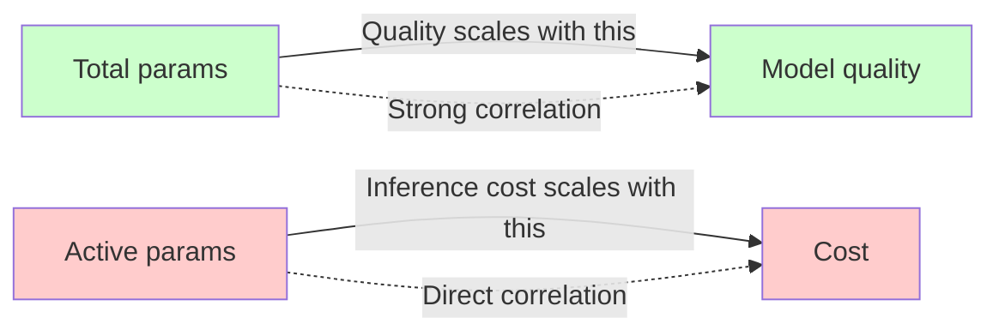

# Scaling, FLOPs, memory

Chương này derive parameter count, FLOPs, memory chính xác cho MoE model. Cho phép bạn tính active/total trước khi train, predict throughput.

## Parameter count breakdown

Một model MoE có:

**1. Embedding + LM head**:

$$
P_\text{embed} = V \cdot d, \quad P_\text{lm\_head} = V \cdot d
$$

Nếu tied: total $= V \cdot d$. Else $2 V d$.

**2. Attention (mỗi layer)**:

Standard GQA:

$$
P_\text{attn} = d \cdot (h \cdot d_\text{head}) + 2 \cdot d \cdot (h_\text{kv} \cdot d_\text{head}) + (h \cdot d_\text{head}) \cdot d
$$

(Q proj + K proj + V proj + O proj, no bias.)

Llama Q O cùng size, K V smaller (GQA).

**3. Router**:

$$
P_\text{router} = d \cdot E
$$

(Linear no bias.)

**4. Expert (mỗi expert, mỗi layer)**:

SwiGLU expert:

$$
P_\text{expert} = 2 d \cdot d_\text{ff} + d \cdot d_\text{ff} = 3 d \cdot d_\text{ff}
$$

(gate_proj + up_proj + down_proj.)

Với concatenated layout: same total.

**5. Shared expert (nếu có)**:

$$
P_\text{shared} = 3 d \cdot d_\text{ff,shared}
$$

**6. Layer norm** (negligible, $2d$ each, total $L \cdot 4d$).

## Active params per token

$$
P_\text{active} = P_\text{embed/lm\_head} + L \cdot \left[ P_\text{attn} + P_\text{router} + k \cdot P_\text{expert} + E_s \cdot P_\text{shared} \right]
$$

(Router luôn active. Attention luôn active. $k$ expert active. Shared luôn active.)

## Total params

$$
P_\text{total} = P_\text{embed/lm\_head} + L \cdot \left[ P_\text{attn} + P_\text{router} + E \cdot P_\text{expert} + E_s \cdot P_\text{shared} \right]
$$

(Tất cả $E$ expert được count.)

## Sparsity ratio

$$
\rho = \frac{P_\text{active}}{P_\text{total}}
$$

## Tính concrete: DeepSeek-V3

$$
d = 7168, \quad d_\text{ff} = 2048, \quad L = 61, \quad L_\text{moe} = 58
$$

$$
E = 256, \quad E_s = 1, \quad k = 8, \quad V = 129280
$$

**Embedding + LM head** (tied):

$$
P_\text{embed} = 129280 \cdot 7168 \approx 0.93\text{B}
$$

**Attention per layer** (MLA, simplified):

$$
P_\text{attn} \approx d^2 \cdot 4 \approx 7168^2 \cdot 4 / (some factor for MLA compression) \approx 0.5\text{B per layer}
$$

61 layer: $\approx 30\text{B}$ for attention.

**Router per layer**:

$$
P_\text{router} = 7168 \cdot 256 \approx 1.8\text{M}
$$

58 layer: $\approx 106\text{M}$.

**Expert per layer**:

$$
P_\text{expert} = 3 \cdot 7168 \cdot 2048 \approx 44\text{M per expert}
$$

256 expert × 58 layer: $256 \cdot 58 \cdot 44\text{M} \approx 654\text{B}$.

**Shared expert per layer**:

$$
P_\text{shared} = 3 \cdot 7168 \cdot 2048 \approx 44\text{M}
$$

58 layer: $58 \cdot 44\text{M} \approx 2.6\text{B}$.

**Total**:

$$
P_\text{total} \approx 0.93 + 30 + 0.1 + 654 + 2.6 \approx 688\text{B}
$$

(Slightly above paper's 671B; my estimates approximate. Real DeepSeek-V3 paper: 671B.)

**Active**:

$$
P_\text{active} \approx 0.93 + 30 + 0.1 + 8 \cdot 44\text{M} \cdot 58 + 2.6 \approx 0.93 + 30 + 20.4 + 2.6 \approx 54\text{B}
$$

(Paper: 37B. Difference due to MLA attention is smaller in active.)

OK, approximation. Actual paper values:

| Quantity | Value |
|---|---|
| $P_\text{total}$ | 671B |
| $P_\text{active}$ | 37B |
| Sparsity | 94.5% |

## FLOPs analysis

### Per forward pass (decode 1 token)

For each matmul $Y = X W$ với $X \in \mathbb{R}^{m \times d}$, $W \in \mathbb{R}^{d \times n}$:

$$
\text{FLOPs} = 2 m n d
$$

(2 vì multiply + add.)

### Attention FLOPs (per layer)

Q,K,V,O projection:

$$
\text{FLOPs}_\text{proj} = 2 \cdot N \cdot (d \cdot d + 2 \cdot d \cdot d_\text{kv,total} + d \cdot d) = 2 N d^2 \cdot (2 + 2 \rho_\text{kv})
$$

trong đó $\rho_\text{kv} = h_\text{kv} / h$ (GQA ratio).

QK^T:

$$
\text{FLOPs}_\text{qkt} = 2 N h T d_\text{head}
$$

(với T = current sequence length.)

Softmax: $O(N h T)$, nhỏ so với matmul.

AV:

$$
\text{FLOPs}_\text{av} = 2 N h T d_\text{head}
$$

Total attention per layer:

$$
\text{FLOPs}_\text{attn} \approx 2 N d^2 \cdot (2 + 2 \rho_\text{kv}) + 4 N h T d_\text{head}
$$

### Expert FLOPs (per active expert per layer)

$$
\text{FLOPs}_\text{expert} = 2 \cdot N_e \cdot (2 d \cdot d_\text{ff} + d \cdot d_\text{ff}) = 6 N_e d \cdot d_\text{ff}
$$

trong đó $N_e$ là token nhận về expert này (sau routing).

Tổng N_e qua $E$ expert: $N \cdot k$ (mỗi token đi $k$ expert).

Tổng FLOPs MoE per layer:

$$
\text{FLOPs}_\text{moe,layer} = 6 N k d \cdot d_\text{ff}
$$

### So với dense

Dense FFN (intermediate $d_\text{ff,dense}$):

$$
\text{FLOPs}_\text{dense,ffn} = 6 N d \cdot d_\text{ff,dense}
$$

Ratio MoE/dense FFN:

$$
\frac{\text{FLOPs}_\text{moe}}{\text{FLOPs}_\text{dense}} = \frac{k \cdot d_\text{ff}}{d_\text{ff,dense}}
$$

**Mixtral 8x7B vs hypothetical Llama-7B FFN**:

- Mixtral $d_\text{ff} = 14336$, $k = 2$ → effective $2 \cdot 14336 = 28672$.
- Llama-7B $d_\text{ff,dense} = 11008$.
- Ratio = 2.6x more FFN FLOPs cho Mixtral.

Active params: Mixtral 12.9B vs Llama-7B 7B → 1.84x ratio. Quá khớp.

**DeepSeek-V3 vs hypothetical Llama-30B**:

- DeepSeek $d_\text{ff} = 2048$, $k = 8$ → $16384$.
- Llama-30B-like $d_\text{ff,dense} \approx 20000$.
- Ratio = 0.82x. DeepSeek FLOPs ít hơn dense same FFN width.

DeepSeek has more attention (61 layer × MLA).

## Memory analysis

### Model weight memory

$$
M_\text{weight} = P_\text{total} \cdot b
$$

Bf16: $b = 2$. DeepSeek-V3: $671\text{B} \cdot 2 = 1342$ GB. (Need to shard.)

### Active weight (per forward step)

$$
M_\text{weight,active} = P_\text{active} \cdot b
$$

DeepSeek: $37 \cdot 2 = 74$ GB. Fit 1 H100.

Note: total weight phải loaded vào memory hệ thống (RAM), active loaded vào HBM cho compute. Practice: shard total across GPUs.

### KV cache memory

$$
M_\text{cache} = 2 L_\text{attn} B T h_\text{kv} d_\text{head} b
$$

(2 cho K + V.)

**DeepSeek-V3 với MLA**:

MLA cache stores latent $\mathbf{c}_\text{kv} \in \mathbb{R}^{d_\text{kv,lora}}$ thay vì K, V:

$$
M_\text{cache,MLA} = L_\text{attn} B T d_\text{kv,lora} b
$$

Với $d_\text{kv,lora} = 512$, $b = 2$, $L_\text{attn} = 61$, $B = 1$, $T = 128000$:

$$
M_\text{cache,MLA} = 61 \cdot 1 \cdot 128000 \cdot 512 \cdot 2 / 10^9 \approx 8\text{ GB}
$$

So với Llama-3-70B standard ($h_\text{kv} = 8$, $d_\text{head} = 128$):

$$
M_\text{cache,Llama70B} = 2 \cdot 80 \cdot 1 \cdot 128000 \cdot 8 \cdot 128 \cdot 2 / 10^9 \approx 41\text{ GB}
$$

MLA tiết kiệm 5x cache memory.

### Activation memory (training)

Hidden state qua layer (saved cho backward):

$$
M_\text{activation,layer} = B T d b = B T d b
$$

L layer: $L B T d b$.

**Mixtral 8x7B, batch 4, seq 2048**: $32 \cdot 4 \cdot 2048 \cdot 4096 \cdot 2 / 10^9 \approx 2.1$ GB. Manageable.

Plus gradient (cùng size). Plus Adam state (4x weight). Total memory budget:

$$
M_\text{train} \approx M_\text{weight} \cdot (1 + 1 + 4) + M_\text{activation} + M_\text{cache}
$$

$$
\approx 6 P_\text{total} \cdot b + M_\text{activation}
$$

Mixtral 8x7B train: $6 \cdot 47 \cdot 2 = 564$ GB just for weight/grad/Adam. Need cluster.

## Visualization: memory profile

```
Memory breakdown for Mixtral 8x7B inference (1 H100 80GB):

100 GB |
       |
 90 GB |  ████████████████████████████████  Total budget = 80 GB
       |
 80 GB |  ┌────────────────────────────┐
       |  │ Weight (bf16)              │  24 GB (47B params × 0.5 bytes after 4-bit AWQ)
 70 GB |  │                            │
       |  └────────────────────────────┘
 60 GB |  ┌────────────────────────────┐
       |  │ KV cache @ 32k context     │  16 GB
 50 GB |  │ batch=8                    │
       |  └────────────────────────────┘
 40 GB |  ┌────────────────────────────┐
       |  │ Activation buffer          │  8 GB
 30 GB |  └────────────────────────────┘
       |
 20 GB |  ┌────────────────────────────┐
       |  │ CUDA workspace             │  4 GB
 10 GB |  └────────────────────────────┘
       |
  0 GB |__________________________________________
       Weight  KV    Activ   CUDA   Free (~28 GB)

Total used: ~52 GB. Free for larger batch or context.
```

## Throughput estimation

Tokens per second (decode, single batch, single GPU):

$$
\text{TPS} = \frac{1}{\text{step latency}} \approx \frac{1}{2 P_\text{active} / \text{GPU FLOPS}}
$$

(Assuming compute-bound. Actually decode is memory-bound, formula approximate.)

Memory-bound decode:

$$
\text{TPS}_\text{memory-bound} = \frac{\text{GPU bandwidth}}{\text{Active weight size}} = \frac{\text{HBM bw}}{P_\text{active} \cdot b}
$$

**H100 HBM bandwidth = 3.35 TB/s**:

- Mixtral 8x7B active 12.9B × 2 = 25.8 GB → TPS = 3350 / 25.8 ≈ 130 tokens/s.
- DeepSeek-V3 active 37B × 2 = 74 GB → TPS = 3350 / 74 ≈ 45 tokens/s.
- Llama-3-70B dense × 2 = 140 GB → TPS = 3350 / 140 ≈ 24 tokens/s.

Reasonable estimates. Real throughput phụ thuộc kernel efficiency.

## Sparsity efficiency curve



Modern MoE goal: maximize $P_\text{total}$ (quality) while minimizing $P_\text{active}$ (cost). Sparsity $\rho \to 0$ (low).

```
Sparsity ratio over models (lower = more sparse):

Llama-3-70B:    100% ████████████████████  Dense baseline
Mixtral 8x7B:    28% █████                Coarse MoE
Qwen3-30B-A3B:   10% ██                   Fine-grained
DeepSeek-V3:    5.5% █                    Ultra-fine
GPT-OSS-120B:   4.4% █                    Production
```

Xu hướng: sparsity ratio giảm theo năm. 2025+ có thể đến 2-3%.

## Pitfall

**1. FLOPs không tính tokens drop (Switch)**: nếu capacity drop 10% token, actual FLOPs thấp hơn formula. Adjust theo capacity factor và drop rate.

**2. Active params không bằng GPU memory**: total params phải fit (load). Active là compute. Hai memory budget khác nhau.

**3. KV cache với MLA**: cache shape khác MHA. Đừng dùng formula MHA cho DeepSeek-V3.

**4. Bandwidth-bound vs compute-bound**: small batch decode → bandwidth-bound (TPS giới hạn HBM). Large batch prefill → compute-bound. Formula khác.

**5. Activation memory với gradient checkpointing**: chỉ save subset activation, recompute rest. Memory giảm $\sqrt{L}$ lần, compute tăng 33%.

Chương sau ta phân tích communication bandwidth (EP).
