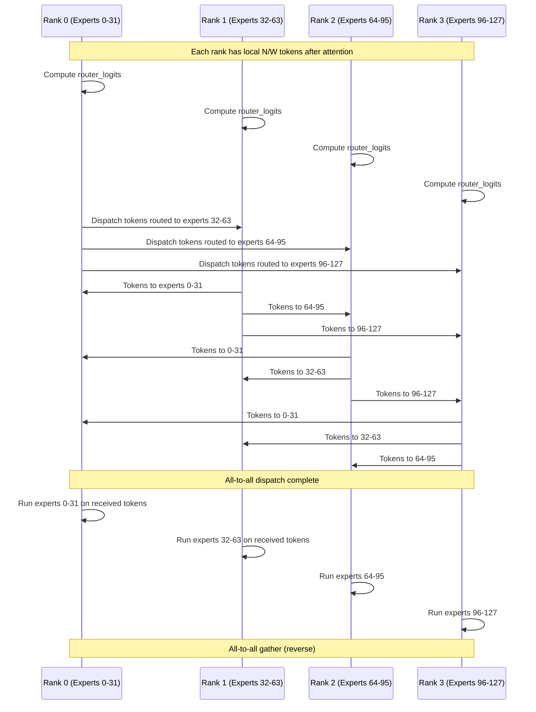
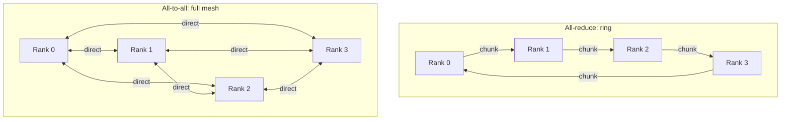
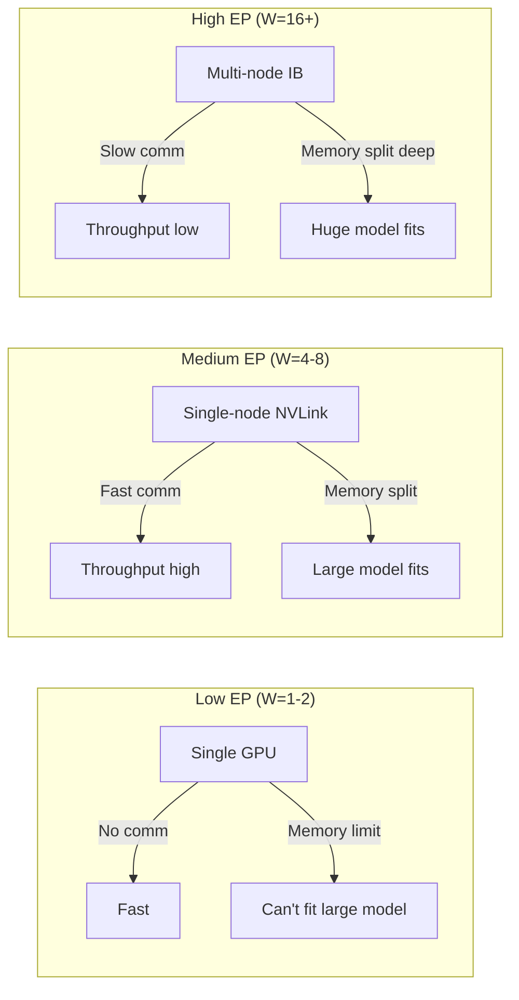

# Communication bandwidth analysis

EP cần communication giữa GPU. Chương này tính bandwidth requirement chính xác, so sánh NVLink vs InfiniBand, identify bottleneck.

## Setup

EP với $W$ rank (GPU). Mỗi rank giữ $E/W$ expert.

Forward MoE layer:



## Payload size per all-to-all

Token: $N/W$ per rank (after attention shard by data parallel). Top-k = $k$.

Total token-expert pairs cross-rank: $\frac{N k}{W} \cdot \frac{W - 1}{W}$ (giả định uniform routing across rank).

Approximation: $\frac{Nk}{W} \cdot (1 - 1/W)$. Với $W$ lớn: $\approx \frac{Nk}{W}$.

Wait, simpler: total pairs = $Nk$. Each pair có hidden vector $d \cdot b$ bytes. Total bytes dispatched per layer:

$$
B_\text{dispatch} = N \cdot k \cdot d \cdot b
$$

Tương tự cho gather. Tổng per MoE layer:

$$
B_\text{moe,layer} = 2 N k d b
$$

(2 cho dispatch + gather.)

## Per forward step

$L_\text{moe}$ layer:

$$
B_\text{forward} = 2 L_\text{moe} N k d b
$$

## Cụ thể DeepSeek-V3

$L_\text{moe} = 58$, $N = B T$. Inference batch 1, prefill 4096:

$$
N = 4096, \quad k = 8, \quad d = 7168, \quad b = 2
$$

$$
B_\text{forward} = 2 \cdot 58 \cdot 4096 \cdot 8 \cdot 7168 \cdot 2 \approx 54.4 \text{ GB}
$$

Per forward pass: ~54 GB data move.

## Bandwidth comparison

| Interconnect | Bandwidth | Latency |
|---|---|---|
| NVLink (H100) | 900 GB/s | ~1 µs |
| NVLink (A100) | 600 GB/s | ~1 µs |
| InfiniBand HDR 200G | 25 GB/s | ~5 µs |
| InfiniBand NDR 400G | 50 GB/s | ~3 µs |
| PCIe Gen4 x16 | 32 GB/s | ~1 µs |
| PCIe Gen5 x16 | 64 GB/s | ~1 µs |

## Time per all-to-all

$$
t_\text{comm} = \frac{B_\text{layer}}{\text{Bandwidth}}
$$

Per MoE layer (2 all-to-all = $2 N k d b$):

```
DeepSeek-V3 prefill, N=4096, single-batch:
  Per layer payload: 2 × 4096 × 8 × 7168 × 2 / 10^9 ≈ 0.94 GB

NVLink:  0.94 / 900 = 1.04 ms per layer
IB 400G: 0.94 / 50  = 18.8 ms per layer
IB 200G: 0.94 / 25  = 37.6 ms per layer
```

Per full forward (58 MoE layers):

```
NVLink:  58 × 1.04 = 60 ms
IB 400G: 58 × 18.8 = 1090 ms = 1.1 sec
IB 200G: 58 × 37.6 = 2180 ms = 2.2 sec
```

**Conclusion**: cross-node InfiniBand bottleneck nghiêm trọng cho EP. Single-node multi-GPU (NVLink) khả thi.

## Visualization: communication overhead

```
Forward latency breakdown (DeepSeek-V3, N=4096, EP=8):

NVLink single-node:
[Attention 30ms]████████████
[Routing 5ms]██
[Comm 60ms] ████████████████████████
[Expert compute 150ms] ████████████████████████████████████████████████████████████
[Norm/residual 5ms]██
─────────────────────────────
Total: ~250 ms

InfiniBand 400G cross-node:
[Attention 30ms]████████████
[Routing 5ms]██
[Comm 1100ms] ████████████████████████████████████████████████████████████████████████████████████████████████████████████████████████████████████████████████████████████████████████████████████████████████████████████████████████████████████████████████
[Expert compute 150ms] ████████████████████████████████████████████████████████████
[Norm/residual 5ms]██
─────────────────────────────
Total: ~1290 ms (communication dominates)
```

## Sequence-level routing impact

Sequence-level aux loss (DeepSeek-V3) tries to balance per sequence. Lý do communication:

Cho batch của $B$ sequence, mỗi sequence $T$ token, total $N = B T$.

Without sequence-level balance: 1 sequence có thể 90% token đi 1 GPU. GPU đó nhận load không cân.

```
Without sequence-level balance:
  Sequence 0: 90% tokens → GPU 0
  Sequence 1: 90% tokens → GPU 1

  Per-GPU load:
    GPU 0: 90% from seq 0 + 10% from seq 1 = sum 100% × something
    GPU 1: similar
  Imbalanced.

With sequence-level balance:
  Sequence 0: 12.5% to each GPU (assuming 8 GPUs)
  Sequence 1: 12.5% to each GPU

  Per-GPU load:
    GPU 0: 12.5% + 12.5% = 25% × 2 = 25% × N
  Balanced.
```

Sequence-level loss giúp utilization đồng đều hơn, giảm tail latency.

## All-reduce vs All-to-all bandwidth

TP dùng all-reduce. EP dùng all-to-all. Khác biệt:

**All-reduce ring algorithm**:

$$
t_\text{allreduce}(M, W) \approx \frac{2 (W-1) M}{W \cdot \text{BW}} \approx \frac{2M}{\text{BW}}
$$

(Mỗi rank send $M(W-1)/W$ bytes, receive same.)

**All-to-all**:

$$
t_\text{alltoall}(M, W) \approx \frac{M (W-1) / W}{\text{BW per pair}} \approx \frac{M}{\text{BW}}
$$

(Mỗi pair send/receive $M/W$ bytes simultaneously.)

Với same total payload $M$, all-to-all approximately 2x faster than all-reduce (theory). Practice depends on topology, congestion.



NVLink full mesh native, all-to-all fast. InfiniBand fat-tree topology, all-to-all chia BW.

## Group routing communication saving

DeepSeek-V3 group routing: token chỉ đi $k_G = 4$ group thay vì all 8.

Communication only between rank trong selected group + sender.

```
Without group routing:
  Each token can go to any of W ranks → full all-to-all.
  Payload per layer: 2 N k d b (as derived).

With group routing (k_G groups out of G):
  Each token goes to k_G groups.
  Payload reduced: 2 N k d b × (k_G / G)
```

DeepSeek-V3: $k_G / G = 4/8 = 0.5$. Cut communication in half.

50% saving important cho multi-node EP.

## Sentinel handling overhead

Sentinel mask: rank xử lý nhưng token weight = 0. Compute wasted.

Number of sentinel rows = N × (k - k_local) où $k_\text{local}$ là số expert chọn thuộc local rank.

Expected: $k_\text{local} = k / W$. Sentinel = $N (k - k/W) = N k (1 - 1/W)$.

% wasted compute = $(W - 1) / W$. With W=8: 87.5% compute wasted on sentinels.

**Mitigation**: HF infrastructure uses `clamp_` + post-mask. Sentinel rows return 0 vector, sum-reduce ignores them. Compute wasted but correct.

Cost: $(W - 1) / W$ of expert FLOPs là wasted. For $W = 8$: 87.5% wasted means compute = 8× single-GPU baseline. Tức là EP scaling tốt khi $W \le E$ (mỗi rank có expert).

## Latency-bandwidth tradeoff



Sweet spot: single-node NVLink với $W = 4$-$8$ GPU.

## Practical recipe

Cho model size $P_\text{total}$ với MXFP4 (4-bit):

$$
W \ge \frac{P_\text{total} \cdot 0.5}{80 \text{ GB}}
$$

(80 GB là H100. 0.5 byte/param cho MXFP4.)

DeepSeek-V3: $W \ge 671 \cdot 0.5 / 80 = 4.2$. Cần 5+ H100 hoặc shard otherwise.

Pure bf16: $W \ge 16+$ H100, multi-node cần.

## Pitfall

**1. All-to-all không hỗ trợ trên một số GPU cũ**: NCCL primitive cần version mới.

**2. Communication compute overlap**: cần async stream. `torch.cuda.Stream` + `wait_event`. Naïve sync version slow.

**3. Token imbalance gây tail latency**: 1 GPU nhận 2x token bình thường. Other GPU wait. Throughput drop.

**4. Cross-node fragmentation**: nếu mỗi node có 8 GPU và W=16 (2 node), nửa traffic over IB. Slow.

**5. Sentinel compute waste**: 87.5% với W=8. Necessary cost. Alternative: dispatch chỉ active expert, nhưng compile khó vì shape dynamic.

Chương cuối ta thấy tất cả diagrams trong một chỗ.
