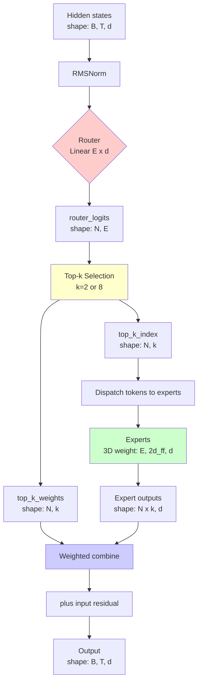
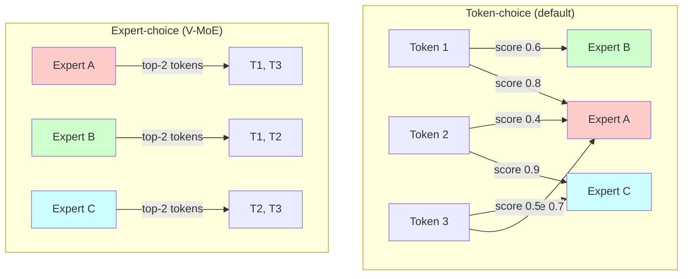
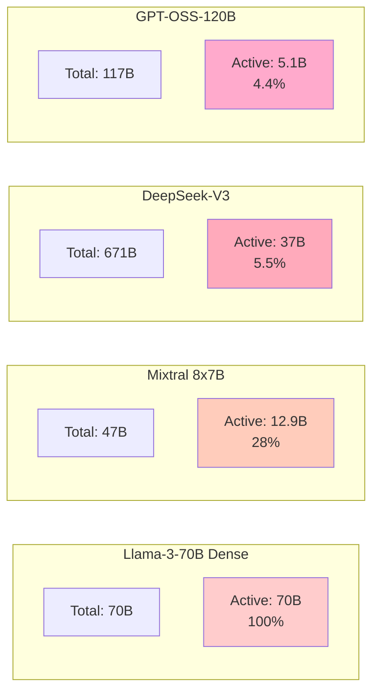
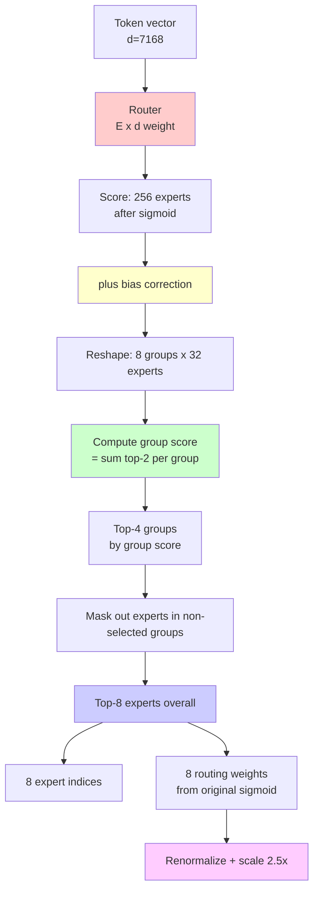
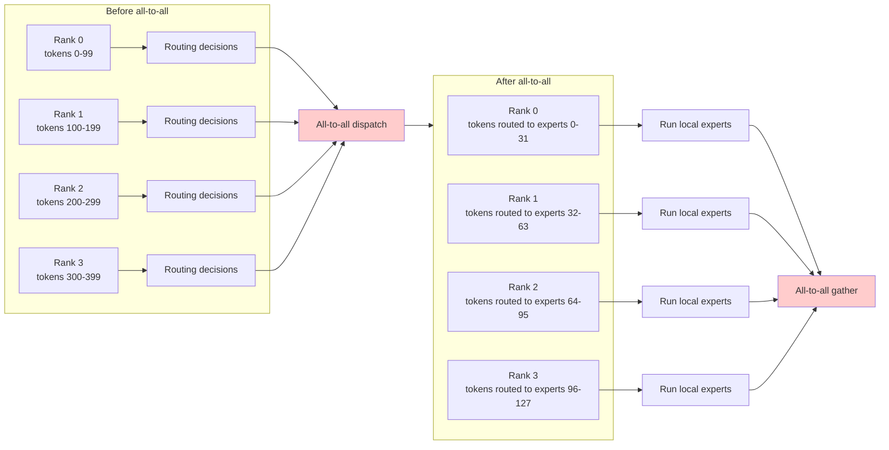
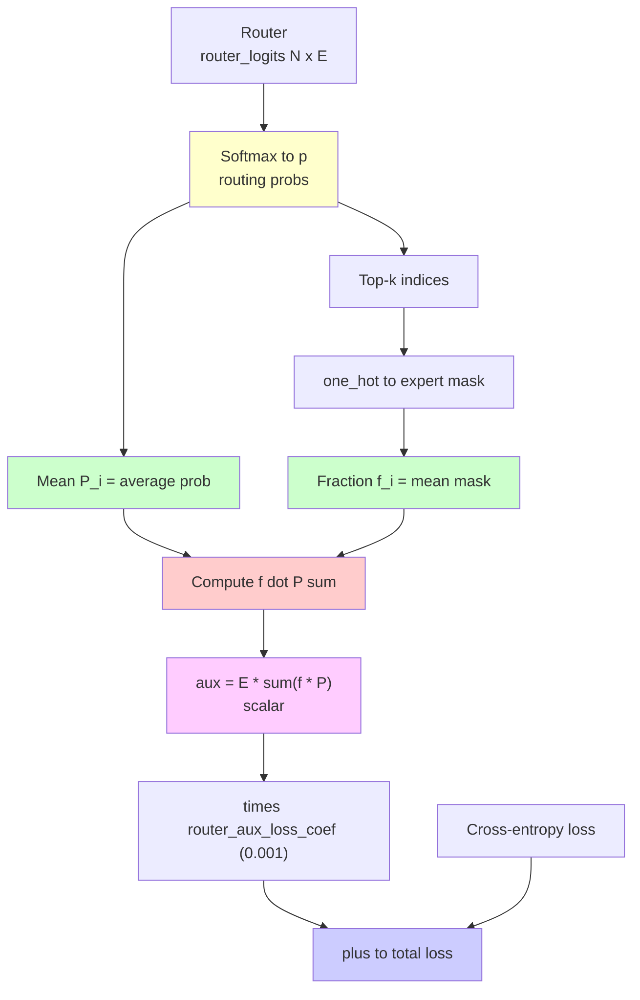
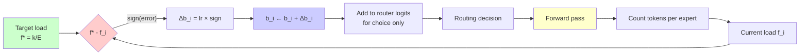
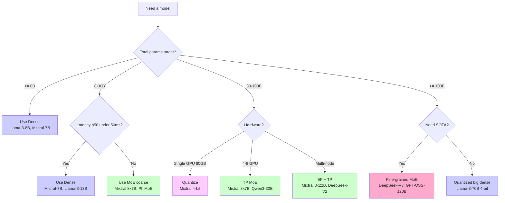

# Visualizations gallery

Tất cả diagram + chart trong một chỗ. Dùng để slide, blog, hoặc reference quick. Mỗi diagram có caption giải thích.

## 1. MoE block tổng thể



**Caption**: Forward pass một SparseMoeBlock. Router (đỏ) → top-k (vàng) → experts (xanh lá) → combine (xanh dương).

## 2. Token-choice vs Expert-choice routing



**Caption**: Token-choice: token chọn expert (default LLM). Expert-choice: expert chọn token (vision MoE).

## 3. Sparsity comparison



**Caption**: Sparsity progression 2023-2025. Density giảm dần, từ 100% (dense) xuống 4.4% (GPT-OSS-120B).

## 4. Group routing (DeepSeek-V3)



**Caption**: DeepSeek-V3 two-stage routing. Score 256 expert → group → select 4 groups → top-8 trong selected groups. Bias cộng vào choice nhưng không vào output weights.

## 5. Expert parallelism dispatch



**Caption**: EP forward pass. Hai all-to-all communication: dispatch (route token to local experts) và gather (collect output back to origin).

## 6. Load balancing aux loss flow



**Caption**: Auxiliary loss computation flow. Sử dụng cả $\mathbf{f}$ (token fractions, không-diff) và $\mathbf{P}$ (mean probs, diff). Dot product penalize imbalance.

## 7. Bias adjustment as feedback control



**Caption**: DeepSeek-V3 bias adjustment as P-controller feedback loop. Error = target - actual. Sign-based update. No gradient.

## 8. Active vs Total params chart

```
Sparsity Progression Bar Chart (Active / Total ratio):

Llama-3-70B Dense:
████████████████████████████████████████ 100% (Active = Total)

Mixtral 8x7B:
███████████ 28% (12.9B / 46.7B)

Qwen3-30B-A3B:
████ 10% (3B / 30B)

DeepSeek-V2:
████ 9% (21B / 236B)

DeepSeek-V3:
██ 5.5% (37B / 671B)

GPT-OSS-120B:
██ 4.4% (5.1B / 117B)

Year:    2022    2023    2024    2025
Trend:   Coarse  ────────────────► Fine-grained
Sparsity: Low  ────────────────► High
```

## 9. Layer architecture variations

```mermaid
graph TB
    subgraph Llama["Llama (Dense)"]
        L1["Embedding"] --> L2["Attention"]
        L2 --> L3["MLP dense"]
        L3 --> L4["Norm"]
        L4 -.->|"x32 layers"| L2
        L4 --> L5["LM head"]
    end

    subgraph Mixtral["Mixtral"]
        M1["Embedding"] --> M2["Attention"]
        M2 --> M3["MoE block<br/>8 experts, top-2"]
        M3 --> M4["Norm"]
        M4 -.->|"x32 layers"| M2
        M4 --> M5["LM head"]
        style M3 fill:#cfc
    end

    subgraph DeepSeek["DeepSeek-V3"]
        D1["Embedding"] --> D2["Attention MLA"]
        D2 --> D3{"layer under 3?"}
        D3 -->|"Yes"| D4["MLP dense"]
        D3 -->|"No"| D5["MoE block<br/>256 + 1 shared, top-8"]
        D4 --> D6["Norm"]
        D5 --> D6
        D6 -.->|"x61 layers"| D2
        D6 --> D7["LM head"]
        style D5 fill:#cfc
        style D3 fill:#ffc
    end

    subgraph Jamba["Jamba"]
        J1["Embedding"] --> J2{"Layer type?"}
        J2 -->|"attn"| J3["Attention"]
        J2 -->|"mamba"| J4["Mamba SSM"]
        J3 --> J5{"ffn type?"}
        J4 --> J5
        J5 -->|"dense (50%)"| J6["MLP"]
        J5 -->|"sparse (50%)"| J7["MoE block<br/>16 experts, top-2"]
        J6 --> J8["Norm"]
        J7 --> J8
        J8 -.->|"x32 layers"| J2
        J8 --> J9["LM head"]
        style J7 fill:#cfc
        style J4 fill:#fcc
        style J3 fill:#cff
    end
```



**Caption**: Layer pattern comparison. Llama mọi layer dense. Mixtral mọi layer MoE. DeepSeek-V3 3 layer đầu dense, rest MoE. Jamba mixed (Mamba/Attention × Dense/MoE).

## 10. KV cache size comparison

```
KV Cache Memory at 128k Context (batch=1, bf16):

Llama-3-70B (MHA, 8 KV heads):
██████████████████████████████ 41 GB

DeepSeek-V3 (MLA, 512 latent):
███████ 8 GB (5x smaller!)

Mixtral 8x7B (GQA, 8 KV heads):
███████████ 17 GB

GPT-OSS-120B (GQA, 8 KV heads):
█████████ 12 GB
```

## 11. Communication bandwidth tier

```
Bandwidth tier per all-to-all (DeepSeek-V3 forward, N=4096):

Single GPU (no comm):  ~0 ms
██

NVLink (intra-node, 900 GB/s):  ~60 ms
████████████████████

InfiniBand 400G (cross-node, 50 GB/s):  ~1090 ms
██████████████████████████████████████████████████████████████████████

InfiniBand 200G:  ~2180 ms
████████████████████████████████████████████████████████████████████████████████████████████████████████████████████████████████████████
```

**Caption**: All-to-all latency tier. NVLink (single-node) practical cho EP. Cross-node IB nghiêm trọng bottleneck.

## 12. Routing entropy evolution

```
Routing entropy H(p) during training (8-expert model):

H (nats)
log(8)=2.08 |█  ← Init (uniform)
       1.80 | ███
       1.50 |    █████████
       1.20 |             █████████  ← Healthy (specialization)
       0.90 |                       ████████
       0.60 |                                ███████  ← Stable
       0.30 |
        0.0 |__________________________________________
            0    20k   50k   100k   200k   500k   step

UNHEALTHY (no aux loss):
H (nats)
log(8)=2.08 |█  ← Init
       1.50 |  ███
       1.00 |     █████
       0.50 |          ██████
       0.10 |                ███████████████████  ← Collapse (1 expert dominates)
        0.0 |__________________________________________
```

**Caption**: Healthy training: entropy stabilize ~1.0-1.5 (chuyên hoá nhưng không collapse). Unhealthy: entropy → 0 (expert collapse).

## 13. FLOPs breakdown (Mixtral 8x7B prefill)

```
FLOPs breakdown per forward (Mixtral 8x7B, prefill N=4096):

Attention (Q,K,V,O + softmax): 1.0 TFLOP
██████████ 11%

Router: 0.01 TFLOP (negligible)
▏ <1%

Expert (top-2 of 8): 7.8 TFLOPs
█████████████████████████████████████████████████████████████████████████████ 79%

Layer norm: 0.05 TFLOP
▏ 1%

Other (residual, etc.): 1.0 TFLOP
██████████ 10%

Total: ~10 TFLOPs per forward
```

**Caption**: Expert compute dominate (79%). Router cost negligible. Attention significant but ~11%.

## 14. Decision tree: MoE vs Dense



**Caption**: Decision tree khi chọn architecture. Tham khảo Phần 5 Chương 5 cho details.

## 15. Throughput chart by configuration

```
TPS (tokens/sec) by configuration (DeepSeek-V3, prefill N=4096):

1× H100, single-batch decode:
██████ 45 TPS (memory-bandwidth limited)

8× H100 NVLink, batch 8, decode:
█████████████████████████████ 600 TPS (utilization improves)

8× H100 NVLink, batch 32, mixed prefill+decode:
████████████████████████████████████████████████ 1500 TPS

4× H100 × 2 nodes IB 400G, batch 32:
███████████████ 350 TPS (cross-node bottleneck)
```

**Caption**: Throughput scales với batch + intra-node bandwidth. Cross-node communication penalty đáng kể.

## Đề xuất sử dụng

Các diagram trên có thể dùng:

1. **Slide presentation**: copy-paste Mermaid blocks vào draw.io hoặc Mermaid Live Editor để export PNG/SVG.
2. **Blog post**: render trực tiếp trong Markdown.
3. **Tài liệu cho team**: kèm theo derivation Chương 3 cho training discussion.
4. **Quick reference**: print Chương 6 ra giấy.

Để export PNG từ Mermaid:

```bash
npm install -g @mermaid-js/mermaid-cli
mmdc -i diagram.mmd -o diagram.png -t dark
```

Phần 6 kết thúc. Toàn bộ chuỗi bài giảng hoàn chỉnh.
